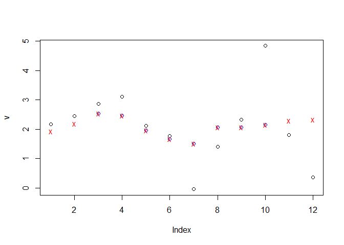

circle\_apply
================

## Description

This is a wrapper for zoo::rollapply() allowing to fill the resulting
leading and tailing NAs by cirlcling the vector back on itself. Apply a
function to a vector and fill the ends by circling the vector so that
the last values proceed the head and the first values follow the tail.
Useful to smooth vectors that can be regarded as repetitive e.g. daily
climatologies.

### Arguments

*values* – vector of values

*n* – size of the rolling window (passed to width argument of
zoo::rollapply)

*fun* – function to apply (passed to FUN argument of zoo::rollapply),
defaults to “mean”

### Example

``` r
set.seed(200)
v <- rnorm(12, 2, 2)
r <- zoo::rollapply(v, 5, mean, fill=NA)
s <- circle_apply(v, n = 5)
plot(v)
points(r, col="blue")
points(s, col="red", pch="x")
```

<!-- -->
